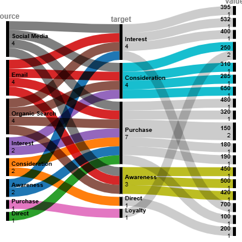

# ga7_q6_tds

# Customer Journey Alluvial Diagram

## Author
**Email:** 22f3000814@ds.study.iitm.ac.in

## Task Overview
This repository contains a professional Alluvial Diagram created using **RAWGraphs**. The visualization represents the customer journey flow from awareness to purchase across different channels, helping businesses understand conversion patterns and optimize marketing strategies.

## Data Structure
The chart is based on realistic synthetic customer journey data, structured as a source-target-value table. Example format:

| source       | target     | value |
|--------------|-----------|-------|
| Social Media | Purchase  | 395   |
| Direct       | Interest  | 532   |
| Email        | Awareness | 400   |
| ...          | ...       | ...   |

15–20 rows of data were used to simulate realistic business scenarios.

## Visualization
- **Chart Type:** Alluvial Diagram  
- **Tool:** [RAWGraphs](https://rawgraphs.io/)  
- **Customization:** Color palettes, labels, and flow sizing were adjusted for professional presentation.  
- **Image Dimensions:** 512×512 pixels (PNG format)  

## Repository Contents
- `README.md` – This file with email and task description  
- `chart.png` – Generated Alluvial Diagram visualization  

## Instructions for Validation
- Ensure `README.md` contains the email **22f3000814@ds.study.iitm.ac.in**  
- `chart.png` is between 300×300 and 512×512 pixels  
- Diagram accurately represents source-target flows in a customer journey context  
- Visualization is professional and presentation-ready
